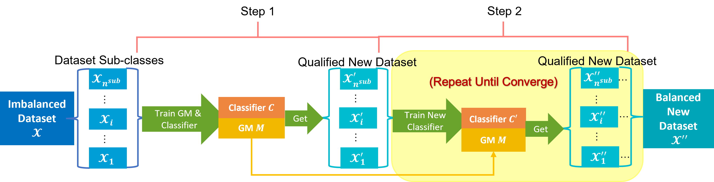
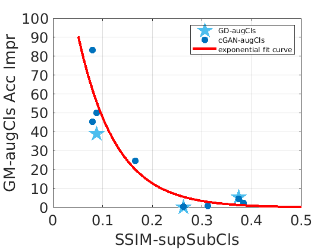
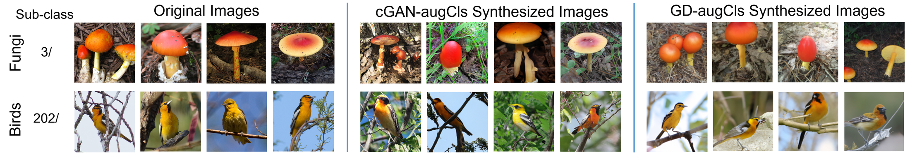

# Structural Similarity: When to Use Deep Generative Models for Imbalanced Image Dataset Augmentation

<p align="center">
  
  
  
  
</p>

**Image Dataset Class Similarity vs. Deep Generative Model Data-Augmentation Classification Improvement**

Research code for studying **when deep generative models are actually useful for re-balancing imbalanced image datasets**. Instead of applying generative augmentation blindly, this project measures inter-class visual similarity first and uses it as an indicator of the expected downstream classification gain.

**Core finding:** the relative top-1 classification improvement obtained from generative data augmentation decreases sharply as visually similar classes become harder to distinguish.

**Authors:** Chenqi Guo, Fabian Benitez-Quiroz, Qianli Feng, Aleix Martinez

---

## Why this project?

Deep generative models such as class-conditional GANs and diffusion models can synthesize samples for minority classes and turn a long-tailed training set into a more balanced one. However, augmentation is not equally effective for every dataset.

When different classes share highly similar shape, color, texture, or background patterns, a generator may fail to reproduce the subtle class-specific details required by the classifier. In such cases, generating more images can provide little benefit and may even introduce ambiguous samples.

This project asks a practical question:

> **Can we estimate whether generative data augmentation is worth using before paying the cost of training and sampling from a deep generative model?**

We address this with a dataset-level structural-similarity metric and an iterative generate-filter-retrain pipeline.

---

## Main Contributions

### 1. SSIM-supSubCls: a class-similarity metric

We extend Structural Similarity (SSIM) from pairs of images to hierarchical image datasets. Original classes are grouped into semantically or visually related **super-classes**, and image similarity is measured inside each super-class.

For a super-class set \(\mathcal{X}_k\), its expected image similarity is

$$
\mathrm{SSIM}_{\mathrm{set}}(\mathcal{X}_k)
= \mathbb{E}_{\mathbf{I}_a,\mathbf{I}_b \in_R \mathcal{X}_k}
\left[\mathrm{SSIM}(\mathbf{I}_a,\mathbf{I}_b)\right].
$$

The final dataset score is the **largest** similarity among all super-classes:

$$
\mathrm{SSIM}_{\mathrm{supSubCls}}(\mathcal{X})
= \max_{k=1,\ldots,K}
\mathrm{SSIM}_{\mathrm{set}}(\mathcal{X}_k).
$$

A higher SSIM-supSubCls value means that at least one group of classes is highly visually similar and is therefore more difficult for both the generator and classifier to resolve correctly.

### 2. GM-augCls: generate, filter, and re-train

The proposed **Deep Generative Model Data Augmentation Classification (GM-augCls)** pipeline uses a generator to synthesize candidate minority-class images and a classifier to retain only samples predicted as belonging to the intended class with sufficient confidence.

<p align="center">
  
</p>

The process is iterative:

1. Train a deep generative model and a classifier on the original imbalanced dataset.
2. Generate candidate images for under-represented classes.
3. Filter generated images with the classifier.
4. Add qualified images to the training set.
5. Re-train the classifier on the augmented dataset.
6. Repeat until the validation improvement converges or the augmentation target is reached.

The experiments use a **StyleGAN2-based transitional cGAN** or **Guided Diffusion** for synthesis, and **ResNet18** or **Masked Autoencoder (MAE)** models for classification / filtering.

### 3. A predictive relationship between class similarity and augmentation gain

Across the evaluated datasets, the relative accuracy improvement after GM-augCls follows a common exponential-decay trend with respect to SSIM-supSubCls:

$$
\hat{f}(x)=0.94^{202.74x-79.92},
$$

where \(x\) is SSIM-supSubCls and \(\hat{f}(x)\) estimates the relative classification improvement in percent.

<p align="center">
  
</p>

The fitted relationship achieved \(R^2=0.8749\) for cGAN-augCls and \(R^2=0.9597\) for Guided-Diffusion augmentation in the reported experiments.

---

## Experimental Results

The study evaluates long-tailed or imbalanced subsets from **iNaturalist-2019**, together with **Flowers**, **UTKFace**, and **Scene** datasets.

| Dataset | SSIM-supSubCls | cGAN-augCls relative accuracy improvement |
|---|---:|---:|
| UTKFace | 0.3834 | 2.41% |
| Birds | 0.3742 | 4.57% |
| Insects | 0.3115 | 0.77% |
| Scene | 0.2625 | 0.59% |
| Flowers | 0.1652 | 24.73% |
| Fungi | 0.0880 | 50.00% |
| Reptiles | 0.0793 | 45.44% |
| Amphibians | 0.0792 | 83.35% |

The pattern is consistent: datasets with **lower class similarity** receive much larger gains from generated data, while datasets with highly similar classes receive little improvement.

> In these experiments, substantial gains begin to appear around SSIM-supSubCls values at or below 0.1652. This should be interpreted as an empirical observation from the evaluated datasets rather than a universal hard threshold.

### Qualitative examples

<p align="center">
  
</p>

The examples above compare original samples with images generated by the cGAN-augCls and Guided-Diffusion pipelines for Fungi and Birds subclasses.

---

## Repository Structure

```text
SSIM-DeepGenModelsImbaDataAug/
├── ssim/                    # SSIM / SSIM-LPIPS dataset-similarity utilities
├── transitional-cGAN/       # Transitional class-conditional StyleGAN2 training,
│                            # generation, mapping, and classifier-based selection
├── guided-diffusion/        # Guided Diffusion training / sampling code
├── imbalanced_data/resnet/  # ResNet18 classification and augmentation evaluation
├── mae/                     # MAE-based classification and image selection
├── lpips/                   # LPIPS implementation used in similarity experiments
└── pytorch-fid/             # FID evaluation utilities
```

The repository contains the experimental code used throughout different stages of the study. Several components are based on or adapted from established research implementations; see **Acknowledgements** below.

---

## Quick Start: Compute SSIM-supSubCls

The most self-contained entry point in this repository is the SSIM-based dataset similarity computation.

### 1. Clone the repository

```bash
git clone https://github.com/chenqiguo/SSIM-DeepGenModelsImbaDataAug.git
cd SSIM-DeepGenModelsImbaDataAug
```

### 2. Install the minimal dependencies

For the SSIM-only metric:

```bash
pip install numpy opencv-python scikit-image
```

For the optional SSIM/LPIPS variant:

```bash
pip install torch torchvision lpips
```

### 3. Prepare an image-list file

`ssim/compute_ssim_metrics.py` expects a text file with one image per line:

```text
relative/path/to/image_0001.jpg 0
relative/path/to/image_0002.jpg 0
relative/path/to/image_0101.jpg 1
relative/path/to/image_0102.jpg 1
```

The first column is the image path relative to `--root`; the second column is the integer **super-class label**.

### 4. Run the metric

```bash
python ssim/compute_ssim_metrics.py \
    --txt /path/to/train_paths_superclass.txt \
    --root /path/to/image_root \
    --out results/my_dataset_ssim.txt
```

Useful options:

```text
-N N          randomly keep at most N images per super-class
--all-pairs   evaluate all image pairs instead of shuffled consecutive pairs
```

The script center-crops and resizes images, computes SSIM within each super-class, reports the mean SSIM for every super-class, and returns the **maximum super-class average** as the final dataset score.

For the experimental SSIM/LPIPS variant:

```bash
python ssim/compute_ssim-lpips_metrics.py \
    --txt /path/to/train_paths_superclass.txt \
    --root /path/to/image_root \
    --out results/my_dataset_ssim_lpips.txt \
    --gpu 0
```

---

## Reproducing the Full GM-augCls Pipeline

The complete experimental workflow combines several research codebases and is more involved than the SSIM-only calculation:

### Step A — Build the class hierarchy

Group visually or semantically related original classes into super-classes. For iNaturalist subsets, the paper uses species, habitat, size, shape, and color information to form these groups.

### Step B — Measure class similarity

Compute SSIM-supSubCls on the original imbalanced training set using the utilities under `ssim/`.

### Step C — Train a generator

Use one of the included generative-model implementations:

- `transitional-cGAN/` for the StyleGAN2-based transitional cGAN;
- `guided-diffusion/` for classifier-guided diffusion.

### Step D — Train a classifier

Train a classifier on the original imbalanced dataset:

- `imbalanced_data/resnet/` for ResNet18 experiments;
- `mae/` for Masked Autoencoder / ViT experiments.

### Step E — Generate candidate minority-class samples

For the cGAN branch, `transitional-cGAN/generate_1run_chenqi.py` contains the project-specific multi-class image-generation logic.

### Step F — Filter generated images

Classifier-based filtering is implemented in project-specific scripts such as:

- `transitional-cGAN/imgSelection_chenqi.py`
- `mae/imgSelectionMAE_chenqi.py`

Generated images whose predicted class does not match the intended target are rejected; qualified samples are retained for balancing the training set.

### Step G — Re-train and evaluate

Re-train the classifier on the augmented balanced dataset and compare its validation accuracy with the model trained on the original imbalanced dataset.

> **Research-code note:** several scripts preserve the original experiment-specific paths, checkpoints, dataset names, and GPU settings. Please adapt those variables to your local environment before running an end-to-end reproduction.

---

## Models and Datasets Used in the Study

### Generative models

- StyleGAN2-based transitional class-conditional GAN
- Guided Diffusion with classifier guidance

### Classifiers

- ResNet18
- Masked Autoencoder (MAE) / ViT

### Datasets

- iNaturalist-2019: Birds, Insects, Fungi, Reptiles, Amphibians
- Flowers Recognition
- UTKFace
- Scene Classification

The generators are trained on the original imbalanced training set. Candidate generated images are then filtered by a classifier before being added to the corresponding minority classes.

---

## Takeaway

The main message of this work is simple:

> **Generative augmentation should not be treated as universally beneficial. The visual similarity between classes can be used as a prior indicator of whether synthesized minority-class samples are likely to improve downstream classification.**

SSIM-supSubCls provides a low-cost way to characterize this difficulty before committing to the substantially larger compute cost of training and sampling from deep generative models.

---

## Acknowledgements

This repository incorporates or adapts code from several open-source research projects. Please refer to the original repositories and licenses when using the corresponding components:

- [Transitional cGAN](https://github.com/mshahbazi72/transitional-cGAN) — *Collapse by Conditioning: Training Class-conditional GANs with Limited Data*
- [Guided Diffusion](https://github.com/openai/guided-diffusion) — *Diffusion Models Beat GANs on Image Synthesis*
- [Masked Autoencoders](https://github.com/facebookresearch/mae) — *Masked Autoencoders Are Scalable Vision Learners*
- [LPIPS / PerceptualSimilarity](https://github.com/richzhang/PerceptualSimilarity)
- [PyTorch-FID](https://github.com/mseitzer/pytorch-fid)

Subdirectories may contain their own license and citation information.

---

## Paper

**Structural Similarity: When to Use Deep Generative Models on Imbalanced Image Dataset Augmentation**  
Chenqi Guo, Fabian Benitez-Quiroz, Qianli Feng, Aleix Martinez

Citation information and a public paper link can be added here when available.

---

## Contact

For questions about this project, please open a GitHub issue or contact the repository maintainer through the [GitHub profile](https://github.com/chenqiguo).
